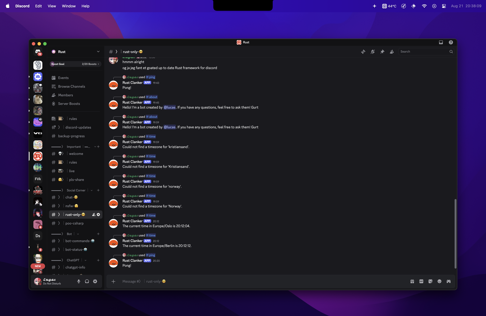

# Discord Bot made in Rust

This project is a simple Discord bot written in Rust. 

### Key Technologies and Crates Used:

*   **Rust**: The programming language used for its performance, safety, and concurrency features.
*   **`poise`**: A Discord bot framework for Rust, built on top of `serenity`. It simplifies the creation and management of bot commands and interactions.
*   **`serenity`**: A powerful and flexible Discord API wrapper for Rust, providing the core functionalities for interacting with the Discord platform.
*   **`tokio`**: An asynchronous runtime for Rust, enabling efficient handling of concurrent operations necessary for a responsive bot.
*   **`dotenv`**: Used for loading environment variables from a `.env` file, securely managing sensitive information like the bot's token.
*   **`chrono` & `chrono-tz`**: Crates for robust date, time, and timezone manipulation, utilized for features such as the `time` command.
*   **`tracing` & `tracing-subscriber`**: For structured logging and diagnostics, aiding in debugging and monitoring the bot's operations.
